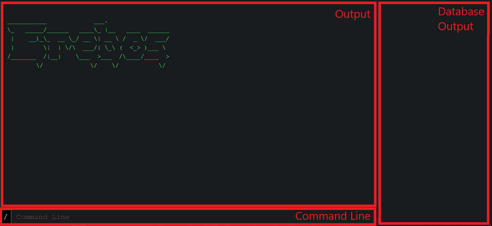
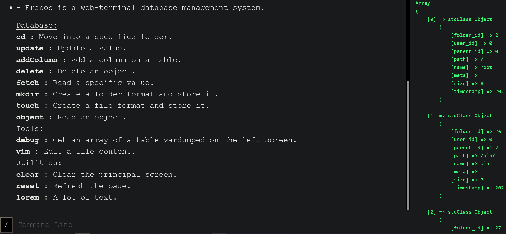

# erebos
erebos is a web-terminal using Vanilla PHP/MySQL powered with my experimental framework `Erebos`.

## Structure
```shell
  ajax\
  ├── jsSide.js
  └── phpSide.php
  assets\
  ├── css\
  ├── img\
  └── js\
  core\
  ├── classes
  ├── erebos.sql
  └── init.php
  helpers\
  └── functions.php
  index.php
```

## Instructions
+ Simply create the MySql database with the `core\erebos.sql` commands.
+ run the project on the `localhost/`

## HELPME
//TODO

## Gallery


